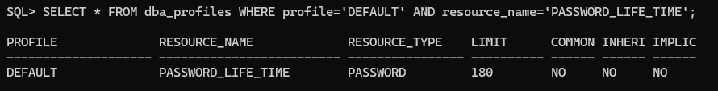
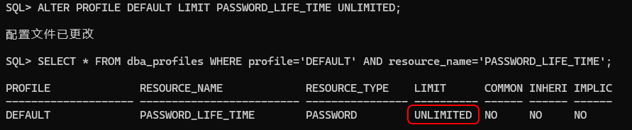

## 解决方案
1. 在Oracle服务器上进入sqlplus。参考命令: 
```sql
sqlplus / as sysdba;
```

2. 执行SQL查看用户密码的有效期设置(一般默认的配置文件是DEFAULT)。
```sql
SELECT * FROM dba_profiles WHERE profile='DEFAULT' AND resource_name='PASSWORD_LIFE_TIME';
```

3. 如上图有效期为默认的180天。以下脚本将密码有效期修改成“无限制”。修改之后立即生效(但已经过期的密码需要重设一次密码)。
```sql
ALTER PROFILE DEFAULT LIMIT PASSWORD_LIFE_TIME UNLIMITED;
```

4. 已经触发有效期限制的用户需参考以下SQL给用户重设一次密码以便更新有效期。
   1. 如果希望密码不变可以使用原密码作为脚本里的密码执行。
   2. SQL语句的用户名、密码需要替换为实际值。
```sql
ALTER USER 用户名 IDENTIFIED BY 密码;
```

5. 使用修改后的用户登录,如果报“ORA-28000:用户已被锁”,可使用以下SQL解锁(注意替换用户名为实际值)。
```sql
ALTER USER 用户名 ACCOUNT UNLOCK;
```